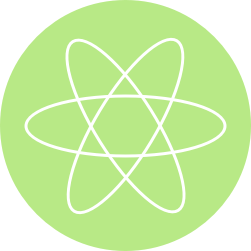

# Reactor

Reactor is a framework for making more reactive applications inspired by [Elm](https://github.com/evancz/elm-architecture-tutorial), [Redux](http://redux.js.org/docs/basics/index.html), and recent work on [ReSwift](https://github.com/ReSwift/ReSwift). It's small and simple (just one file), so you can either use Carthage to stay up to date, or just drag and drop into your project and go.  Or you can look through it and roll your own.

Reactor encourages unidirectional data flow from a single source of truth—i.e., there is one global object responsible for managing application data, and all UI is derived and updated from it. This way your [UI is always in sync with your data](https://medium.com/swift-fox/react-native-native-28e37f7de1ae#.tbp9edrnn), and your data is sync with itself since there are not multiple copies of it floating around your app.


## Architecture

```
                                                     ┌──────────────────┐
                                                     │                  │
                                                     │                  │
                                                     │     Command      │
                                                 ┌───│     (Async)      │
                                                 │   │                  │
                                                 │   │                  │
                                                 │   └──────────────────┘
                                                 │
┌──────────────────┐                             │   ┌──────────────────┐
│                  │                             │   │                  │
│                  │         ┌───────────┐       │   │                  │
│                  │◀────────┤   Event   ├────◀──┴───┤                  │
│                  │         └───────────┘           │                  │
│                  │                                 │                  │
│       Core       │                                 │    Subscriber    │
│                  │                                 │                  │
│                  │                                 │                  │
│    ┌───────┐     │         ┌───────────┐           │                  │
│    │ State │     ├─────────┤   State   ├───────┬──▶│                  │
│    └───────┘     │         └───────────┘       │   │                  │
│                  │                             │   │                  │
└──────────────────┘                             │   └──────────────────┘
                                                 │
                                                 │   ┌──────────────────┐
                                                 │   │                  │
                                                 │   │                  │
                                                 └──▶│    Middleware    │
                                                     │                  │
                                                     │                  │
                                                     └──────────────────┘
```

There are six objects in the Reactor architecture:

1. The `State` object - A struct with properties representing application data.
1. The `Event` - Can trigger a state update.
1. The `Core` - Holds the application state and responsible for firing events.
1. The `Subscriber` - Often a view controller, listens for state updates.
1. The `Command` - A task that can asynchronously fire events. Useful for networking, working with databases, or any other asynchronous task.
1. `Middleware` - Receives every event and corresponding state. Useful for analytics, error handling, and other side effects.

## State

State is anything that conforms to `State`. Here is an example:

```swift
struct Player: State {
    var name: String
    var level: Int

    mutating func react(to event: Event) {
        switch event {
        case let _ as LevelUp:
            level += 1
        default:
            break
        }
    }
}
```

Here we have a simple `Player` model, which is state in our application. Obviously most application states are more complicated than this, but this is where composition comes into play: we can create state by composing states.

```swift
struct RPGState: State {
    var player: Player
    var monsters: Monsters

    mutating func react(to event: Event) {
        player.react(to: event)
        monsters.react(to: event)
    }
}
```

Parent states can react to events however they wish, although this will in most cases involve delegating to substates default behavior.

Side note: does the sight of `mutating` make you feel impure? Have no fear, [`mutating` semantics on value types](http://chris.eidhof.nl/post/structs-and-mutation-in-swift/) here are actualy very safe in Swift, and it gives us an imperative look and feel, with the safety of functional programming.

## Events

We've seen that an `Event` can change state. What does an `Event` look like? In it's most basic form, an event might look like this:

```swift
struct LevelUp: Event {}
```

In other situations, you might want to pass some data along with the event. For example, in an application with more than one player we need to know which player is leveling up.

```swift
struct LevelUp: Event {
    var playerID: Int
}
```

For many events, generics work very nicely.

```swift
struct Update<T>: Event {
    var newValue: T
}
```

## Tying it Together with the Core

So, how does the state get events? Since the `Core` is responsible for all `State` changes, you can send events to the core which will in turn update the state by calling `react(to event: Event)` on the root state. You can create a shared global `Core` used by your entire application (my suggestion), or tediously pass the reference from object to object if you're a masochist.

Here is an example of a simple view controller with a label displaying our intrepid character's level, and a "Level Up" button.

```swift
class PlayerViewController: UIViewController {
    var core = App.sharedCore
    @IBOutlet weak var levelLabel: UILabel!

    override func viewDidAppear(_ animated: Bool) {
        super.viewDidAppear(animated)
        core.add(subscriber: self)
    }

    override func viewDidDisappear(_ animated: Bool) {
        super.viewDidDisappear(animated)
        core.remove(subscriber: self)
    }

    @IBAction func didPressLevelUp() {
        core.fire(event: LevelUp())
    }
}

extension ViewController: Reactor.Subscriber {
    func update(with state: State) {
        levelLabel?.text = String(state.count)
    }
}
```

By subscribing and subscribing in `viewDidAppear`/`viewDidDisappear` respectively, we ensure that whenever this view controller is visible it is up to date with the latest application state. Upon initial subscription, the core will send the latest state to the subscriber's `update` function. Button presses forward events back to the core, which will then update the state and result in subsequent calls to `update`. (note: the `Core` always dispatches back to the main thread when it updates subscribers, so it is safe to perform UI updates in `update`.)

## Commands

Sometimes you want to fire an `Event` at a later point, for example after a network request, database query, or other asynchronous operation. In these cases, `Command` helps you interact with the `Core` in a safe and consistent way.

```swift
struct CreatePlayer: Command {
    var session = URLSession.shared
    var player: Player

    func execute(state: RPGState, core: Core<RPGState>) {
        let task = session.dataTask(with: player.createRequest()) { data, response, error in
            // handle response appropriately
            // then fire an update back to the Core
            core.fire(event: AddPlayer(player: player))
        }
        task.resume()
    }
}

// to fire a command
core.fire(command: CreatePlayer(player: myNewPlayer))
```

Commands get a copy of the current state, and a reference to the Core which allows them to fire Events as necessary.

## Middleware

Sometimes you want to do something with an event besides just update application state. This is where `Middleware` comes into play. When you create a `Core`, along with the initial state, you may pass in an array of middleware. Each middleware gets called every time an event is passed in. Middleware is not allowed to mutate the state, but it does get a copy of the state along with the event. Middleware makes it easy to add things like logging, analytics, and error handling to an application.

```swift
struct LoggingMiddleware: Middleware {
    func process(event: Event, state: State) {
        switch event {
        case _ as LevelUp:
            print("Leveled Up!")
        default:
            break
        }
    }
}
```

## Installation

Follow the installation guides to integrate `Reactor`in your App.

### Swift Package Manager

To integrate `Reactor` in your App using [Swift Package Manager](https://swift.org/package-manager/), specify it in your `Package.swift` file:

```
import PackageDescription

let package = Package(
    [...]
    dependencies: [
        .Package(url: "https://github.com/ReactorSwift/Reactor.git", majorVersion: XYZ)
    ]
)
```

### Carthage

To integrate `Reactor` in your App using [Carthage](https://github.com/Carthage/Carthage), specify it in your `Cartfile`:

```
github "ReactorSwift/Reactor" ~> X.Y.Z
```

Run `carthage update` to build the framework and drag the built Reactor.framework into your Xcode project.
